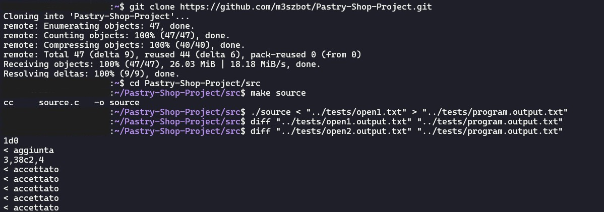

# 🧁 Pastry Shop Management System

**Language:** C  
**Tools:** VS Code  
**Project Type:** Individual  
**Date:** August 2024

A **high-performance administrative software** designed to manage **orders, inventory, and recipes** for a pastry shop.  
The program demonstrates the **practical application of algorithms** and **data structures** to ensure correctness, scalability, and **time-space efficiency**.

The program has **3 versions**, graded 18, 27, or 30 out of 30 based on efficiency constraints.  
The default version is `source`, graded 30.

---

## 📋 Project Overview

This project was developed as part of the **Algorithms and Informatics Principles** course, while studying Computer Engineering BSc at the Politecnico di Milano.  
The exact requirements and tools descriptions are in Italian.

It focuses on:

- Implementing efficient **data structures** and **algorithms**
- Ensuring **correctness** and **performance optimization**
- Processing **stdin commands** dynamically and producing corresponding **stdout results**

The software autonomously:

- Reads an **input sequence** containing specific commands
- Updates the internal state of the program accordingly
- Produces the expected outputs

---

## ✨ Features

- 📦 **Order Management** → Create pastry orders
- 🗃️ **Inventory Control** → Manage ingredients and supplies
- 📜 **Recipe Handling** → Add and delete recipes
- ⚡ **Performance-Oriented Design** → Optimized algorithms for speed and memory
- 🖥️ **Autonomous Processing** → Reads commands from **stdin** and writes results to **stdout**

---

## 🛠️ Prerequisites

Before running the program, ensure your system has:

- **Linux**
- **GCC**
- **Make** (for building with Makefile)
- **Git** (to clone the repository)

---

## 🚀 Instructions

### 1. Open a Linux terminal

### 2. Clone the repository and navigate to /src

```bash
git clone https://github.com/m3szbot/Pastry-Shop-Project.git
cd Pastry-Shop-Project/src
```

### 3. Build the program

```bash
make source
```

### 4. Run the program with the selected input and output files

```bash
./source < input_file > output_file
```

Example:

```bash
./source < "../tests/open1.txt" > "../tests/program.output.txt"
```

### 5. Verify expected and program output

If the program works correctly, there should be no differences between the expected and program output files. If the program output is not correct, differences are written onto the terminal.

```bash
diff expected_output_file program_output_file
```

Examples:

```bash
diff "../tests/open1.output.txt" "../tests/program.output.txt"
diff "../tests/open2.output.txt" "../tests/program.output.txt"
```

---

## 💻 Example


